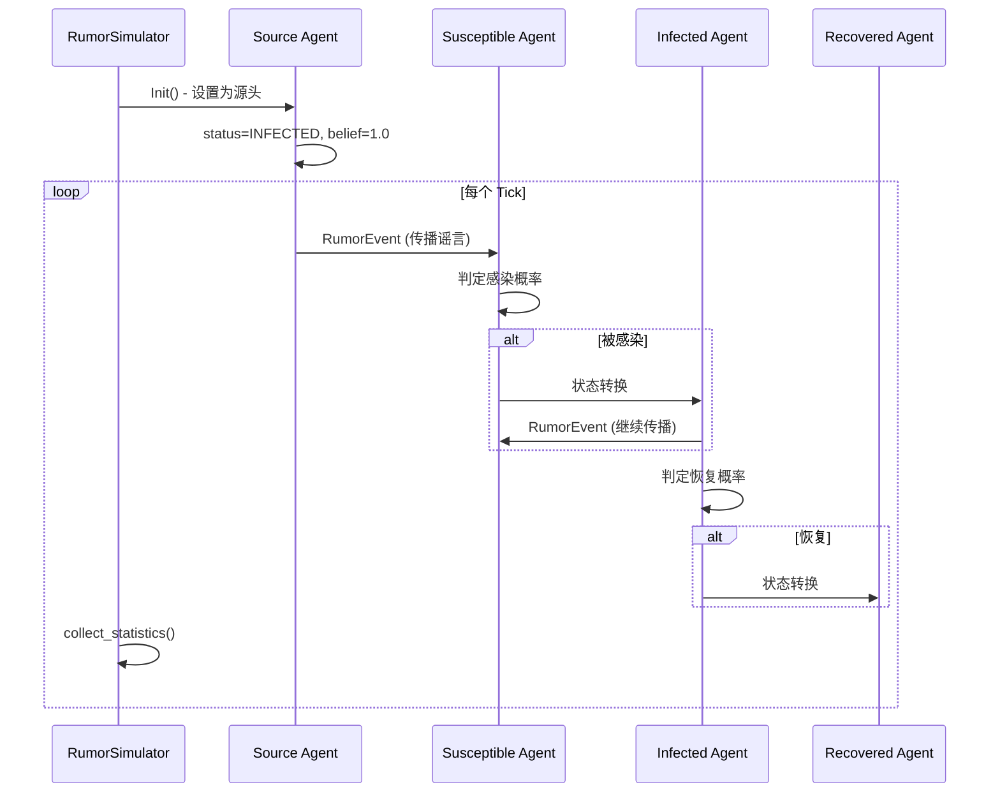
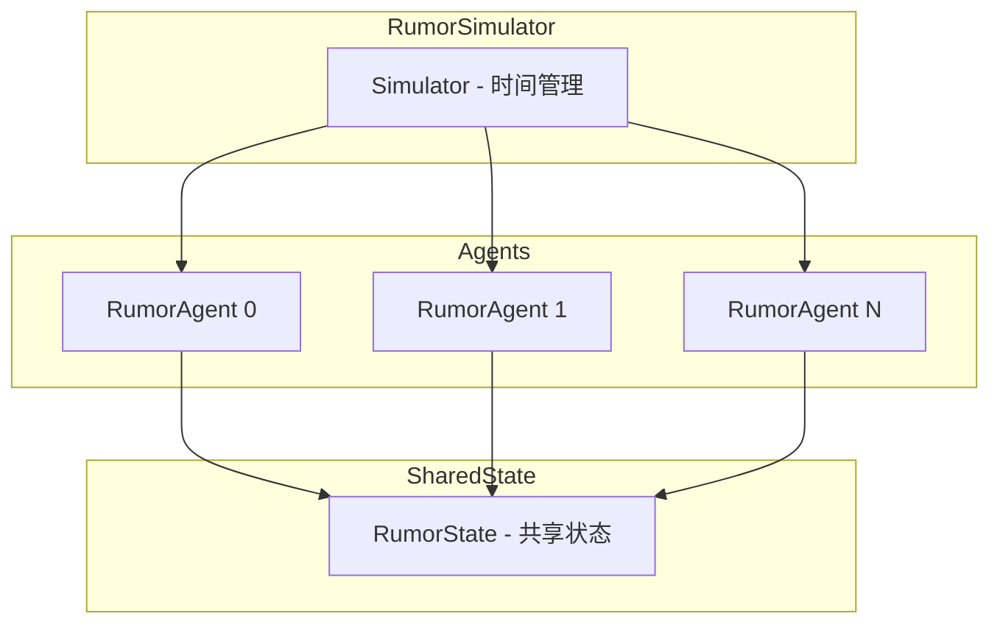

# Rumor Spreading Simulation with MGSIM

基于 causal 框架实现的谣言传播仿真应用，实现了 SIR (Susceptible-Infected-Recovered) 模型。

## 概述

本仿真应用模拟了谣言在社交网络中的传播过程：

- **S (Susceptible)**: 易感者 - 尚未相信谣言的用户
- **I (Infected)**: 感染者 - 相信并传播谣言的用户
- **R (Recovered)**: 恢复者 - 不再相信谣言的用户

## 编译

```bash
cd examples/Rumor
mkdir build && cd build
cmake ..
make
```

## 运行

### 基本运行

```bash
./Rumor
```

### 自定义参数

```bash
./Rumor --num_nodes 1000 --beta 0.1 --gamma 0.2 --network_type 1
```

### 参数说明

| 参数                   | 说明                                         | 默认值  |
|----------------------|--------------------------------------------|------|
| `--num_nodes, -n`    | 网络节点数                                      | 1000 |
| `--beta, -b`         | 感染率                                        | 0.1  |
| `--gamma, -g`        | 恢复率                                        | 0.2  |
| `--network_type, -t` | 网络类型 (0=Random, 1=SmallWorld, 2=ScaleFree) | 1    |
| `--prob, -p`         | 网络连接概率 (Random网络)                          | 0.01 |
| `--suscept_mean, -s` | 平均易感性                                      | 0.5  |

## 输出

仿真结果保存到 `Distribution of Rumor.csv`，包含以下列：

- Time: 仿真时间
- S: 易感者数量
- I: 感染者数量
- R: 恢复者数量
- Infected Rate: 感染率
- Average Belief: 平均相信程度

## 网络类型

1. **Random (ER模型)**: 随机图，每个节点以概率 p 连接
2. **SmallWorld (WS模型)**: 小世界网络，具有高聚类系数
3. **ScaleFree (BA模型)**: 无标度网络，符合幂律分布

## 与原项目对应

| DRL-Rumor-Mitigation | 本实现                       |
|----------------------|---------------------------|
| News类 (SIR传播)        | RumorAgent类               |
| 节点状态 (S/I/R)         | Agent内部状态                 |
| 社交网络图                | igraph网络                  |
| NewsEnv              | RumorSimulator            |
| 传播参数 (beta, gamma)   | 命令行参数                     |
| CSV输出                | Distribution of Rumor.csv |

## 仿真流程

### 1. 初始化阶段 (ParseScenario)

```
┌─────────────────────────────────────────────────────────┐
│  1. 生成社交网络拓扑 (igraph)                            │
│     - Random: Erdős-Rényi 随机图                        │
│     - SmallWorld: Watts-Strogatz 小世界网络              │
│     - ScaleFree: Barabási-Albert 无标度网络              │
├─────────────────────────────────────────────────────────┤
│  2. 创建 RumorAgent                                      │
│     - 为每个节点创建一个 Agent                           │
│     - 设置易感性 (susceptibility) 和恢复率 (recovery)    │
│     - 建立邻居关系 (neighbors) 和粉丝关系 (followers)    │
├─────────────────────────────────────────────────────────┤
│  3. 设置谣言源头 (setSources)                            │
│     - 选择入度最高的节点 (最多粉丝) 作为源头              │
│     - 源头数量 = max(1, 节点总数 × 1%)                  │
│     - 初始化源头状态为 INFECTED，belief_level = 1.0     │
└─────────────────────────────────────────────────────────┘
```

### 2. 仿真运行阶段 (Tick循环)

```
每个时间步 (tick_delta = 0.5):
┌─────────────────────────────────────────────────────────┐
│  SUSCEPTIBLE (易感者)                                    │
│  └─ 等待接收谣言消息                                     │
│      └─ 收到 RumorEvent 后:                             │
│          infection_prob = susceptibility × belief       │
│          随机判定是否被感染 → 转为 INFECTED              │
├─────────────────────────────────────────────────────────┤
│  INFECTED (感染者)                                       │
│  ├─ spreadRumor(): 向所有粉丝发送谣言                    │
│  │   └─ 发送概率 = belief_level                         │
│  └─ recover(): 以 recovery_rate 概率恢复                 │
│      └─ 恢复后转为 RECOVERED                            │
├─────────────────────────────────────────────────────────┤
│  RECOVERED (恢复者)                                      │
│  └─ 不再参与传播，状态不变                               │
└─────────────────────────────────────────────────────────┘
```

### 3. 统计收集 (collect_statistics)

```
每个整数时间点 + 0.1:
  → 统计 S/I/R 各状态人数
  → 计算感染率 = I / 总人数
  → 计算平均相信程度 (仅感染者)
  → 写入 CSV 文件
```

### 仿真流程图



## 架构



